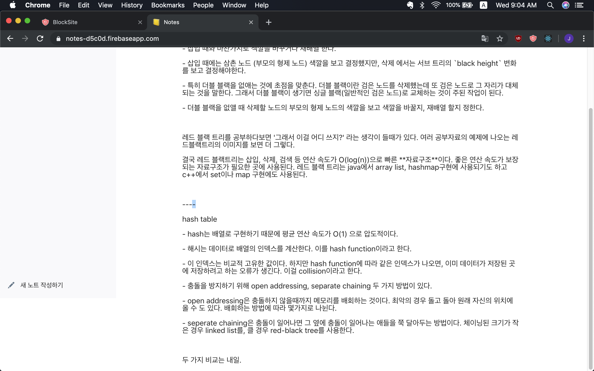
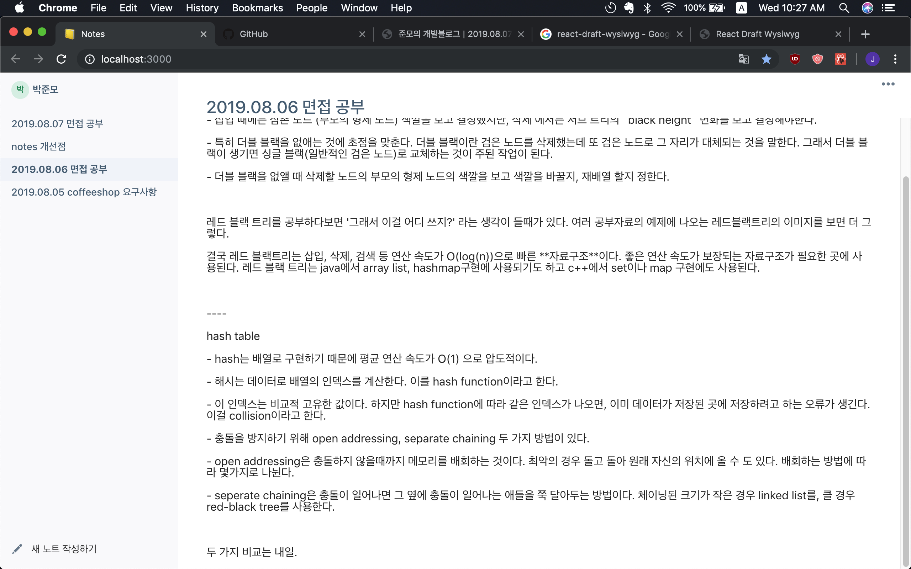

# 📒 Notes
React와 Firebase 로 만든 노트 웹 어플리케이션
https://notes-d5c0d.web.app/

## 특이사항
- `create-react-app`으로 제작. `react-router`, `recompose` 등 사용
- 리엑트 `setState` hook과 context api를 사용하여 인증 정보 관리.
- 노트 작성 후 500ms 지나면 자동 저장. 리엑트 컴포넌트의 `onChange` 이벤트 핸들러와 [lodash.debounce](https://lodash.com/docs/4.17.15#debounce) 사용
- `react-sizes` 활용한 responsive layout. 
- 로그인, 회원가입 등 인증 기능에 Firebase의 authentication api 사용
- database로 firebase의 firestore 사용
- UI Framework으로 [evergreen-ui](https://evergreen.segment.com/) 사용 
- WYSIWYG 에디터 [react-draft-wysiwyg](https://github.com/jpuri/react-draft-wysiwyg) 사용

## 개발 환경
- react 16.8.6
- react-router-dom 5.0.1
- recompose 0.30.0
- firebase 6.3.3
- evergreen-ui 4.18.1
- react-draft-wysiwyg 1.13.2
- lodash 4.17.15
- react-sizes 2.0.0

## 업데이트
- 2019.08.06 에디터 영역의 높이를 100%로 수정. 스크롤바의 위치를 화면 오른쪽에 붙이도록 수정.

before

after

